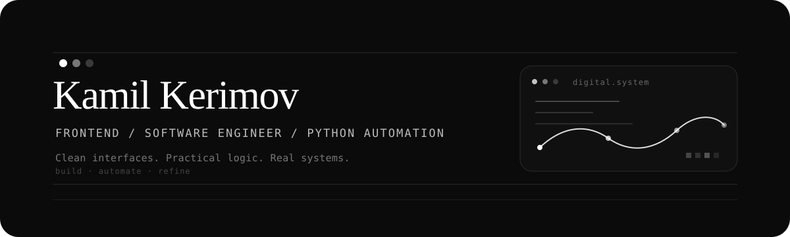

 

 

 

Frontend · Software Engineer · Python Automation · Practical Software

---

### I build clean digital systems with practical logic and sharp interfaces.

 

<table width="100%" align="center">
  <tr>
    <td width="33%" align="center">
      <strong>Interface</strong>
       
      clean, responsive, clear
    </td>
    <td width="33%" align="center">
      <strong>Logic</strong>
       
      structured, useful, maintainable
    </td>
    <td width="33%" align="center">
      <strong>Automation</strong>
       
      less routine, more systems
    </td>
  </tr>
</table>

 

### Stack

 

 
